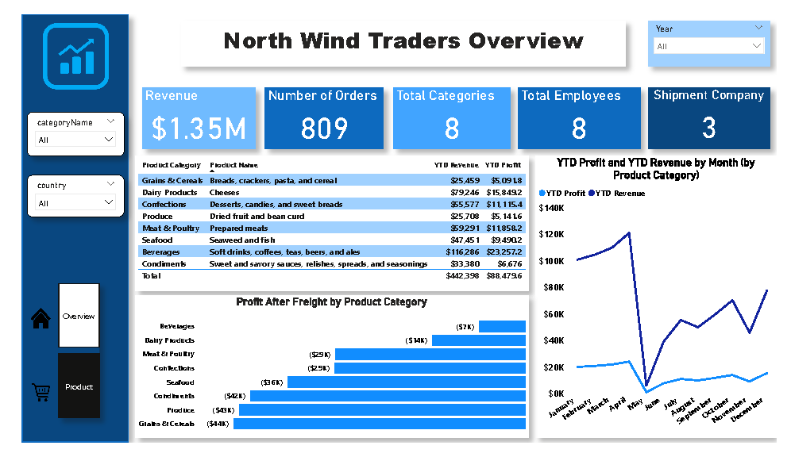

# NorthWind Traders Performance Analysis

## Project Overview
This project focuses on analyzing the performance of NorthWind Traders, a retail company, using key metrics like total revenue, number of orders, and profitability across product categories. The analysis also includes insights into monthly revenue trends and how freight costs impact profitability.

---

## Key Questions Answered
1. **What is the company's total revenue and number of orders?**
2. **Which product categories are generating the highest revenue?**
3. **How does revenue and profit vary across months and product categories?**

---

## Tools and Technologies Used
- **Power BI:** For data visualization and dashboard creation.
- **DAX:** To calculate and visualize key metrics like total revenue, YTD profit, and profit after freight.
- **Microsoft Excel:** Data preprocessing and cleaning.
- **GitHub:** For documenting and sharing the analysis.

---

## Dataset Overview
The dataset includes:
- **Product information:** Categories, names, and revenue generated.
- **Order details:** Total number of orders, revenue by product and month.
- **Employee and shipment data:** Total employees and shipment companies involved.

---

**Key columns in the dataset:**
- `ProductCategory`: The category of each product.
- `ProductName`: Name of the product.
- `YTDRevenue`: Year-to-date revenue for each product.
- `YTDProfit`: Year-to-date profit for each product.
- `FreightCost`: Shipping costs associated with product deliveries.

---

## Data Analysis Process
1. **Data Cleaning and Preparation:**
   - Checked for missing values, inconsistencies, and outliers.
   - Organized data into relevant categories like product types, revenue, and monthly sales.

---

2. **Revenue and Orders:**
   - Total revenue: $1.35M from 809 orders.
   - Visualization of revenue and orders using bar charts and line graphs to show monthly and product performance.

---

3. **Product Category Performance:**
   - The top-performing categories were Beverages and Dairy Products, which contributed significantly to the total revenue.
   - A detailed breakdown of product categories shows their respective shares of total revenue.

---

4. **Monthly Revenue and Profit Trends:**
   - A line graph was used to visualize monthly revenue, highlighting the seasonal peaks and valleys. May and November were top-performing months.
   - Profit after freight costs showed significant variation across categories, with some lower-margin products being less profitable after shipping costs were deducted.

---

## Conclusions and Recommendations
- **Seasonal Trends:** The revenue peaks in specific months suggest that NorthWind Traders should adjust inventory and marketing strategies to capitalize on high-demand periods.
- **Focus on High-Margin Products:** Beverages and Dairy Products are driving significant revenue. However, products with lower profitability due to high freight costs (e.g., Meat & Poultry) should be carefully managed or optimized.
- **Freight Optimization:** Freight costs are reducing profit margins for several categories, especially Seafood and Condiments. NorthWind Traders should negotiate better shipping rates or explore local sourcing options to minimize these costs.

